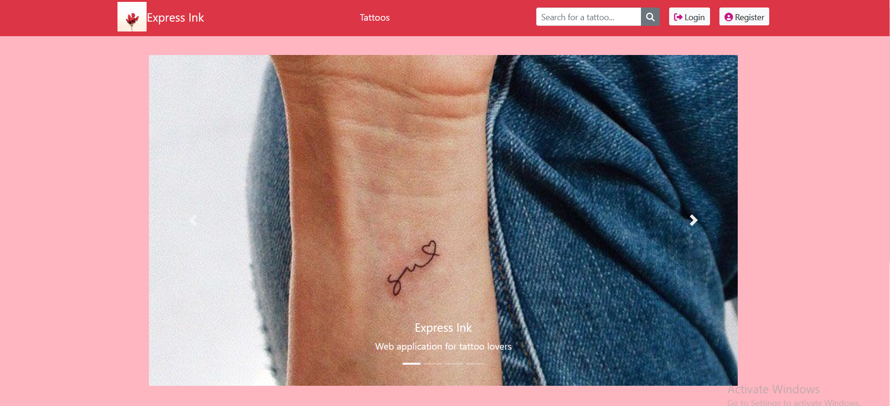
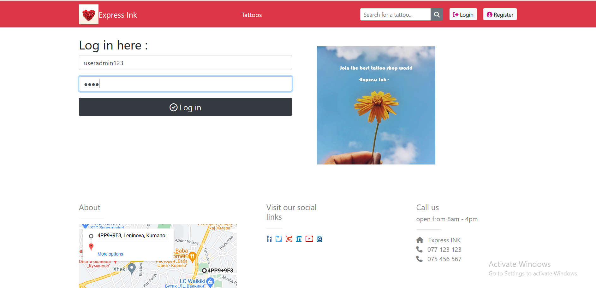
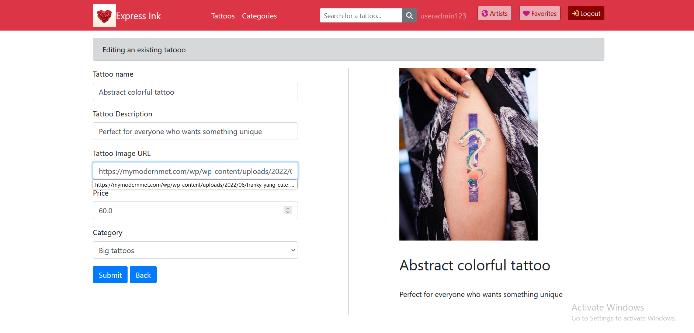
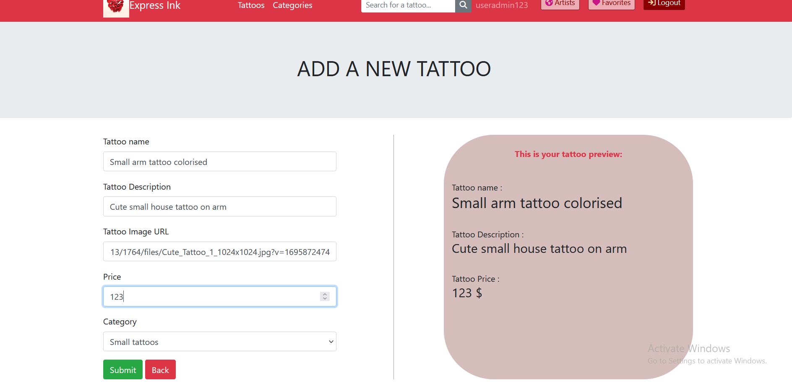
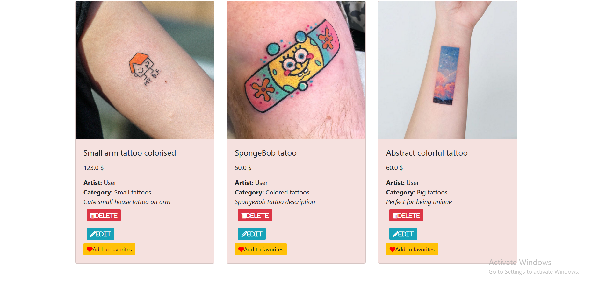
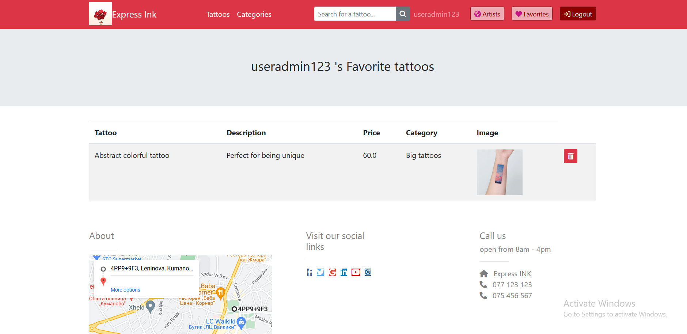
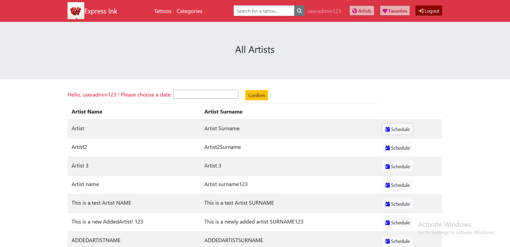

# Express Ink - Tattoo Shop 
Express Ink, is an e-commerce style application, but specifically tailored for tattoo lovers and tattoo artists. It allows clients to browse through a tattoo collection, as well as tattoo artists. Everyone who has registered as an artist, will automatically be displayed in the artists tab.
  - Technologies used: Java SpringBoot, PostgreSQL, Bootstrap, Thymeleaf

## Features
### Running the application
- Application runs on port 9999.
  -  Navigate to https://localhost:9999/ in your browser to use the app.
### Roles and authentication
- Three roles: Admin, User, Artist.
- User and Artist have limited access.
  - No edit or delete are allowed (those buttons are hidden when you're logged in as one of those roles).
  - Can access and add tattoos to favorites
- Non-authenticated users
  - No access to anything except main home page
  - Authentication (creating your account) is required to access app's functionality
  - 
- Pre-defined Admin role:
   - username: useradmin123
    - password: user
    - 
### CRUD functionalities
  - Admin is allowed access to everything (each CRUD operation)
    - Edit a tattoo 
      -   
    - Add a tattoo
     -   
    - Delete a tattoo
 - The 'All Tattoos' are fully functional with all buttons displayed, as long as we're authorized as a user of type admin.
  - note: to <b> User </b> or <b> Artist </b>, are only shown  <b> Add to Favorites </b> button 
 -  
 ### Favorites functionality
  - Every type of user can add (and delete) a tattoo from their Favorites list
  -  
 ### Artists functionality
  - As soon as a user, registers as the role "Artist", their name and surname will be shown in a stripped table in the tab "Artists"
  - There is a schedule button next to each artist which opens up a calendar (note: this functionality is only a prototype, and isn't fully functional/developed yet)
  -  
For any additional information, please feel free to contact me.
 
